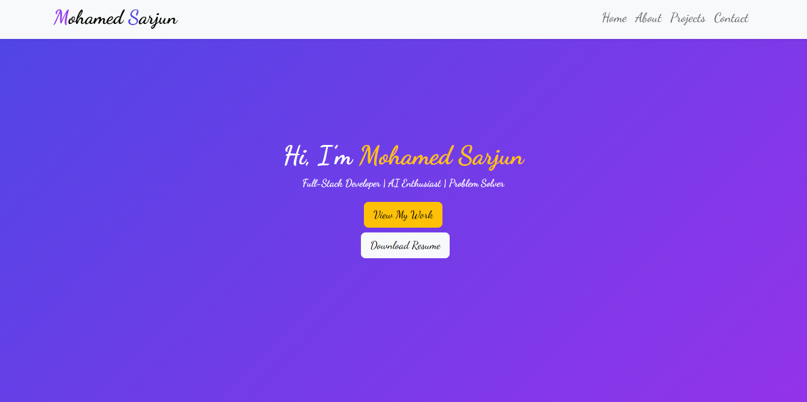
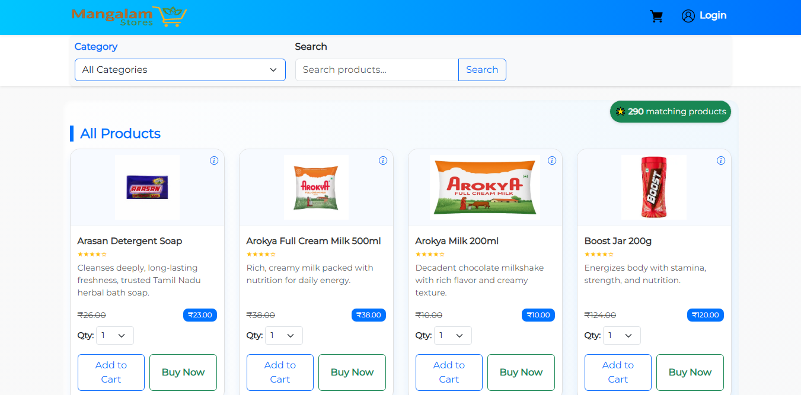
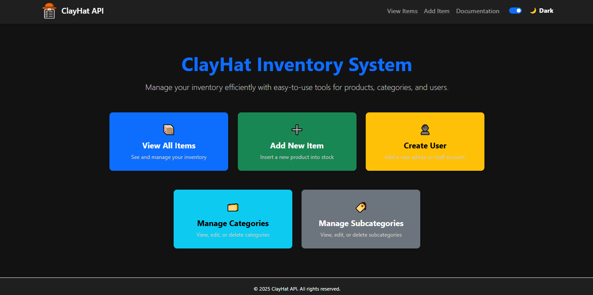

# 🌐 Personal Portfolio Website

A modern, responsive **Portfolio Website** built with **Flask** and **Bootstrap 5**, showcasing my projects, skills, and experience.  

---

## ✨ Features
- 🖼️ Clean and modern UI with responsive design  
- 📂 Projects section with live demo links & previews  
- 🧑 About Me section with skills and background  
- 📬 Contact form with Flask backend integration (email support)  
- 🌙 Smooth navigation with Bootstrap & custom styling  

---

## 🛠️ Tech Stack
**Frontend**  
- HTML5, CSS3, Bootstrap 5, JavaScript  
- Google Fonts & Font Awesome icons  

**Backend**  
- Python (Flask)  
- Jinja2 templating  

**Database (optional if contact form stores messages)**  
- SQLite / MySQL  

**Other**  
- Responsive design  
- Deployed on [Render / PythonAnywhere / Custom Hosting]  

---

## 📸 Screenshots
### 🔹 Home / Hero Section


### 🔹 Projects Section




---

## 🚀 Getting Started

### 1️⃣ Clone Repository
```bash
git clone https://github.com/YOUR-USERNAME/portfolio-website.git
cd portfolio-website
